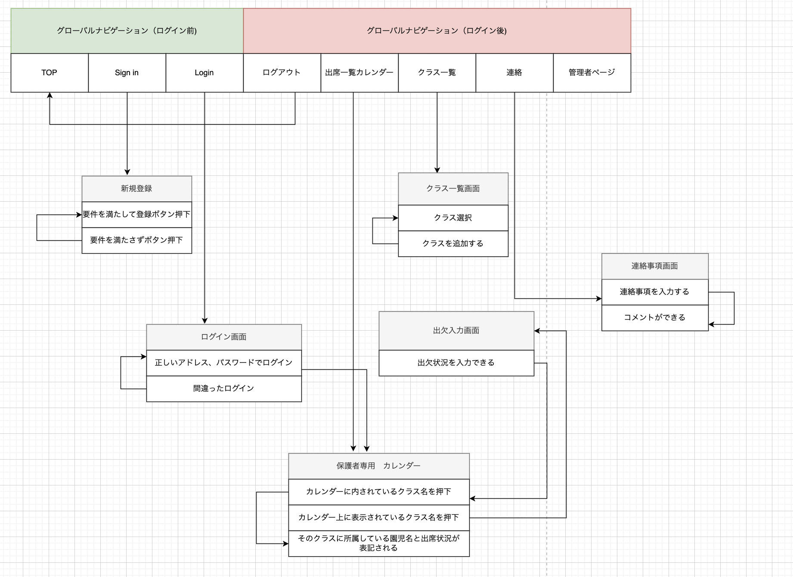

# README
## 開発言語
* Ruby 3.0.1
* Ruby on Rails 6.0.3

## 就業Termの技術
* Devise
* Ajax

## カリキュラム外の技術
* gem rails_admin, gem cancancanを使った管理者機能
* SimpleCalendar

## 実行手順

```
$ git clone git@github.com:ayaka2209/CHILMO.git 
$ cd CHILMO
$ bundle install
$ rails db:create
$ rails db:migrate
$ rails s
```  
## カタログ設計 
https://docs.google.com/spreadsheets/d/1Ms_XPI54QOrsMym3UtHoSeR-KYuhRaSSf3cv1jjt7Q8/edit#gid=632854108

## テーブル定義書  
https://docs.google.com/spreadsheets/d/1Ms_XPI54QOrsMym3UtHoSeR-KYuhRaSSf3cv1jjt7Q8/edit#gid=723145898
## ワイヤーフレーム 
https://www.figma.com/file/xNuncxD8qo6AdRvqC2AmdA/%E7%84%A1%E9%A1%8C?node-id=4%3A23&t=R1jOr1EUTZf7YXgp-0    
## ER図  
https://app.diagrams.net/?client=1#G1egIF3tB0hhpcfGm0LUrO3dcZKNPR0uem
### 画面遷移図
 